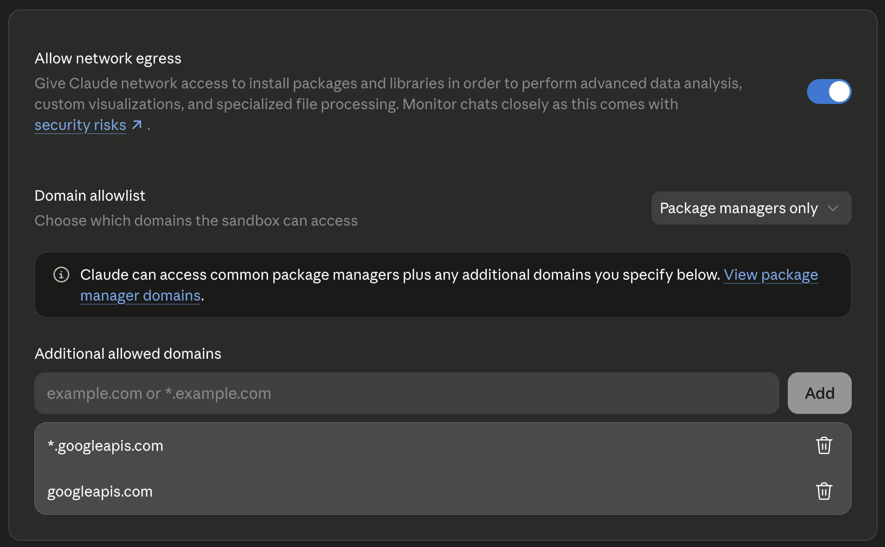

# Custom Google Drive MCP Server

A slimmed-down fork of [`taylorwilsdon/google_workspace_mcp`](https://github.com/taylorwilsdon/google_workspace_mcp) that exposes **only** the Drive tool surface, with the four overlapping tools renamed and reshaped to match the [Claude.ai Google Drive connector](https://support.anthropic.com/en/articles/10168395-using-claude-s-connectors) contract. Drop-in compatible with skills/scripts written against Claude.ai's built-in Drive tools.

## Why this exists

The upstream server is a great general-purpose Workspace MCP, but three things made it unsuitable for drop-in use as a Claude.ai Drive connector replacement:

1. **Tool surface doesn't match Claude.ai's Drive connector.** Skills written against Claude.ai's built-in `search_files`, `read_file_content`, `download_file_content`, `create_file` break against upstream's `search_drive_files`, `get_drive_file_content`, `get_drive_file_download_url`, `create_drive_file`. Param names and response shapes also differ.
2. **`create_drive_file` corrupts binary uploads.** Upstream does `content.encode("utf-8")` regardless of mime type, so passing a base64-encoded xlsx or pptx results in a Drive file whose bytes are the literal base64 ASCII string — not the decoded binary.
3. **It bundles 11 other Google services** (Gmail, Calendar, Docs, Sheets, Slides, Forms, Chat, Tasks, Contacts, Search, Apps Script) that inflate the OAuth consent surface, deploy size, and auth blast radius if you only need Drive.

## What's different vs upstream

| Change | Effect |
|---|---|
| Drive-only `SERVICE_MODULES` (`main.py`) | No Gmail/Calendar/Docs/Sheets/Slides/Forms/Chat/Tasks/Contacts/Search/AppsScript modules in the repo. CLI no longer exposes `--tools`, `--tool-tier`, `--permissions`. |
| Claude.ai-compatible tool surface | Four overlapping tools renamed and reshaped (see table below). Two new tools (`list_recent_files`, `get_file_metadata`) added to complete the surface. |
| `search_files` / `list_recent_files` return JSON | `{"files": [...], "nextPageToken": "..."}` with `id`, `name`, `title`, `mimeType`, `parentId`, `fileSize`, `modifiedTime`, `webViewLink` per item — directly consumable by automation. |
| `download_file_content` returns `EmbeddedResource` blob | Base64 bytes inline, not a temporary URL. Capped at 25 MB by default (env var `DOWNLOAD_FILE_CONTENT_MAX_MB`); over-limit returns a descriptive error pointing to `read_file_content` / shareable link as alternatives. |
| `create_file` auto-converts source MIME types to Google native | `text/csv` → Sheet, `text/markdown`/`text/html`/docx → Doc, xlsx → Sheet, pptx → Slides. Pass `disableConversionToGoogleType: true` to store as-is. |
| Mime-aware `content` encoding (`create_file`) | If `mimeType` starts with `text/` or is one of `application/{json,xml,javascript,yaml,x-yaml}` → UTF-8 encode the string. Otherwise → treat `content` as base64 and decode to bytes. Resumable upload chunked at 5 MB. |
| Dead-code pruning | Removed unused tier loader, comments helpers, granular-permissions module, dev CLI, and all non-Drive scope/service constants. See `Provenance` for the upstream commit. |

The OAuth machinery (Google provider, scopes, session store, callback handling, middleware), `core/` server scaffold, attachment storage, http_utils, tool registry, and `gdrive/drive_helpers.py` are functionally identical to upstream — just trimmed of references to services this fork doesn't ship.

## Drive tools available

### Claude.ai-compatible surface (6 tools — match the built-in Drive connector)

| Tool | Purpose | Key params |
|---|---|---|
| `search_files` | Query-based search across all accessible drives | `query`, `page_size`, `page_token` |
| `list_recent_files` | Most recently modified files (excludes trashed) | `page_size`, `page_token` |
| `get_file_metadata` | Single-file metadata by ID | `fileId` |
| `read_file_content` | Extract text from Docs/Sheets/PDF/Office natively | `fileId` |
| `download_file_content` | Raw bytes as base64 `EmbeddedResource` (capped at `DOWNLOAD_FILE_CONTENT_MAX_MB`, default 25 MB) | `fileId`, `export_format` |
| `create_file` | Create file or folder; auto-converts to Google native unless `disableConversionToGoogleType=true` | `title`, `content` (b64 for binary), `mimeType`, `parentId`, `fileUrl`, `disableConversionToGoogleType` |

### Additional tools preserved from upstream (10 tools)

- `list_drive_items` — list children of a folder
- `create_drive_folder` — dedicated folder creation
- `update_drive_file` — metadata only (rename/move/trash), not content
- `import_to_google_doc` — import MD/DOCX/TXT/HTML/RTF/ODT and convert to a native Google Doc
- `copy_drive_file`
- `get_drive_file_permissions`, `check_drive_file_public_access`
- `get_drive_shareable_link`, `manage_drive_access`, `set_drive_file_permissions`

### Migration from upstream tool names

| Upstream | This fork |
|---|---|
| `search_drive_files` | `search_files` (JSON response, includes `parentId`) |
| `get_drive_file_content` | `read_file_content` (`fileId`, was `file_id`) |
| `get_drive_file_download_url` | `download_file_content` (returns `EmbeddedResource` blob, was URL string; param `fileId`, was `file_id`) |
| `create_drive_file` | `create_file` (params: `title`/`parentId`/`mimeType`, was `file_name`/`folder_id`/`mime_type`) |

---

## Setup

### 1. Prerequisites

- **Python 3.10+** (`.python-version` pins the exact minor version uv will fetch)
- **uv** package manager — install via `curl -LsSf https://astral.sh/uv/install.sh | sh`
- A Google account you'll authorize the server with
- A Google Cloud project (free tier is fine)

### 2. Google Cloud configuration (one-time)

In [console.cloud.google.com](https://console.cloud.google.com), select or create a project, then:

**a. Enable the Drive API**
APIs & Services → Library → search "Google Drive API" → **Enable**.

**b. Configure the OAuth consent screen**
APIs & Services → OAuth consent screen.
- User type: **External** (or **Internal** if you have a Workspace org).
- Add yourself under **Test users** so you can authorize while the consent screen is in testing mode.
- Add scopes:
  - `openid`
  - `https://www.googleapis.com/auth/userinfo.email`
  - `https://www.googleapis.com/auth/userinfo.profile`
  - `https://www.googleapis.com/auth/drive`
  - `https://www.googleapis.com/auth/drive.readonly`
  - `https://www.googleapis.com/auth/drive.file`

**c. Create an OAuth 2.0 Client ID**
APIs & Services → Credentials → **Create credentials** → **OAuth client ID**.
- Application type: **Web application** (not "Desktop app").
- Authorized redirect URIs: `http://localhost:8000/oauth2callback`
- Save the **Client ID** and **Client Secret** — you'll paste them into `.env` next.

### 3. Configure `.env`

```bash
cp env.example .env
```

For the recommended local setup (HTTP transport + OAuth 2.1 + in-memory session storage, matches the Railway production config):

```bash
# Google OAuth client (from step 2c)
GOOGLE_OAUTH_CLIENT_ID=your-client-id.apps.googleusercontent.com
GOOGLE_OAUTH_CLIENT_SECRET=your-client-secret
GOOGLE_OAUTH_REDIRECT_URI=http://localhost:8000/oauth2callback

# Transport
WORKSPACE_MCP_TRANSPORT=streamable-http
WORKSPACE_MCP_PORT=8000
WORKSPACE_MCP_HOST=0.0.0.0

# Externally-reachable URL — used to build the OAuth callback redirect.
# For plain localhost dev, point this at the same host:port the server binds to.
# Tunnel/Railway setups override this with their public HTTPS URL.
WORKSPACE_EXTERNAL_URL=http://localhost:8000

# Auth mode
MCP_ENABLE_OAUTH21=true
WORKSPACE_MCP_STATELESS_MODE=true
```

> If `WORKSPACE_EXTERNAL_URL` is unset the OAuth callback URL is derived from request headers and can drift from what's registered in GCP, causing `redirect_uri_mismatch`. Always set it explicitly to the URL where this MCP is reachable.

For stdio mode (e.g. Claude Desktop), see the alternative recipe under [Run locally](#run-locally) below.

### 4. Install dependencies

```bash
uv sync
```

### 5. Verify

```bash
uv run main.py --transport streamable-http
```

Expected output:
```
Custom Google Drive MCP Server
  Transport: streamable-http
  URL: http://localhost:8000
  OAuth Callback: http://localhost:8000/oauth2callback
  ...
Ready for MCP connections
```

The server listens on `http://localhost:8000/mcp`.

---

## Run locally

### HTTP transport (recommended)

Matches the Railway production setup. Use this for Claude.ai, MCP Inspector, or any client that speaks streamable-http.

```bash
uv run main.py --transport streamable-http
```

Connect a client to `http://localhost:8000/mcp`. The client triggers the OAuth flow on the first tool call — your browser opens, you authorize, the access token lives in server memory for the session.

**Smoke test with MCP Inspector:**
```bash
npx @modelcontextprotocol/inspector
# Transport: streamable-http
# URL: http://localhost:8000/mcp
# Click Connect → do the OAuth handshake → List tools
```

### Stdio transport (Claude Desktop, etc.)

Stdio mode talks the MCP protocol over stdin/stdout instead of HTTP, so the OAuth callback uses a tiny standalone server on port 8000 that auto-starts when needed.

Override `.env` with:
```bash
# Drop or comment these out for stdio mode:
# WORKSPACE_MCP_TRANSPORT=streamable-http
# MCP_ENABLE_OAUTH21=true
# WORKSPACE_MCP_STATELESS_MODE=true

# Required: pin to one Google account
USER_GOOGLE_EMAIL=you@example.com
MCP_SINGLE_USER_MODE=1

# Where credentials persist between runs
WORKSPACE_MCP_CREDENTIALS_DIR=./store_creds
```

Run:
```bash
uv run main.py --single-user
```

Wire into a Claude Desktop config (`~/Library/Application Support/Claude/claude_desktop_config.json`):
```json
{
  "mcpServers": {
    "custom-gdrive": {
      "command": "uv",
      "args": ["run", "/absolute/path/to/this/repo/main.py", "--single-user"]
    }
  }
}
```

### Connect to Claude.ai (web)

Claude.ai's **custom connector** requires a public **HTTPS** URL — `http://localhost` won't work because Anthropic's edge servers, not your browser, fetch the MCP endpoint. Two paths:

1. **Deploy to Railway** (see below) — set `WORKSPACE_EXTERNAL_URL=https://<service>.up.railway.app`.
2. **Tunnel localhost over ngrok / Cloudflare Tunnel** for testing:
   ```bash
   ngrok http 8000
   # copy the https://<id>.ngrok-free.app URL it prints
   ```
   Then in `.env`:
   ```bash
   WORKSPACE_EXTERNAL_URL=https://<id>.ngrok-free.app
   GOOGLE_OAUTH_REDIRECT_URI=https://<id>.ngrok-free.app/oauth2callback
   ```
   And add `https://<id>.ngrok-free.app/oauth2callback` to the GCP OAuth client's authorized redirect URIs. Restart the MCP server after editing `.env`.

In claude.ai → **Settings → Connectors → Add custom connector**:
- **Name:** anything
- **Remote MCP server URL:** `https://<your-external-url>/mcp` *(don't omit the `/mcp` path — POST to `/` returns 405)*

Click **Connect**. The OAuth flow opens in a new tab; authorize with the Google account you added under GCP Console → OAuth consent screen → Test users.

**Whitelist `googleapis.com` in Claude.ai's network egress allowlist.** Claude's analysis sandbox can't reach arbitrary hosts by default, so any tool call that streams file bytes from the sandbox to Google Drive (e.g. uploading a generated xlsx via `create_file`) silently fails until you allow it. In claude.ai → **Settings → Capabilities** → enable **Allow network egress**, leave the dropdown on **Package managers only**, and add these under **Additional allowed domains**:

- `*.googleapis.com`
- `googleapis.com`



Without this, the connector itself works (Claude → MCP → Drive is fine), but any *code execution* step that pushes bytes outbound to Google will be blocked by the sandbox firewall, not by the MCP.

**Free ngrok URLs change on each restart.** Each new URL means re-editing `.env` *and* re-adding the redirect URI in GCP. Use a static domain (paid plan) or Cloudflare Tunnel for a stable setup.

### Docker

```bash
docker compose up --build
```

Equivalent to the HTTP transport recipe; reads `.env` from this directory.

---

## Deploy to Railway

The Dockerfile is set up for Railway as-is:

```bash
# From the repo root
railway up --service custom-gdrive-mcp
```

Set these in Railway service variables (see `env.example`):

- `GOOGLE_OAUTH_CLIENT_ID`, `GOOGLE_OAUTH_CLIENT_SECRET`
- `WORKSPACE_EXTERNAL_URL=https://<service>.up.railway.app`
- `MCP_ENABLE_OAUTH21=true`
- `WORKSPACE_MCP_STATELESS_MODE=true`
- `WORKSPACE_MCP_TRANSPORT=streamable-http`

Add `https://<service>.up.railway.app/oauth2callback` to the GCP OAuth client's authorized redirect URIs.

---

## Smoke-test the binary upload fix

```bash
# 1. Round-trip a small pptx
PPTX=/path/to/test.pptx
B64=$(base64 -i "$PPTX")

# 2. Call create_file via MCP inspector or your client with:
#    title="test_binary.pptx"
#    content=$B64
#    mimeType="application/vnd.openxmlformats-officedocument.presentationml.presentation"
#    disableConversionToGoogleType=true   # keep as pptx, don't convert to Slides

# 3. Download the resulting file from Drive
curl -L -o roundtrip.pptx "<webContentLink>"

# 4. Verify
file roundtrip.pptx        # Should report "Microsoft PowerPoint", not "ASCII text"
md5 "$PPTX" roundtrip.pptx # Should match
```

For a text round-trip (markdown, no base64), pass `mimeType="text/markdown"` and `content=<raw string>` — the UTF-8 path kicks in automatically. Add `disableConversionToGoogleType=true` to keep it as a plain `.md` file (otherwise the auto-convert path turns it into a Google Doc).

---

## Common gotchas

| Symptom | Fix |
|---|---|
| `redirect_uri_mismatch` | The URI in `.env` doesn't exactly match what's registered in GCP. Check protocol (http vs https), port, and path. |
| `Access blocked: This app's request is invalid` | OAuth consent screen isn't published or your Google account isn't in the test-users list. |
| `Drive API has not been used in project ... before or it is disabled` | Step 2a was skipped. The server prints a direct enable link in the error message. |
| `Port 8000 already in use` | Change `WORKSPACE_MCP_PORT` and update the redirect URI in both `.env` and the GCP OAuth client. |
| `--single-user is incompatible with OAuth 2.1 mode` | You set both `MCP_ENABLE_OAUTH21=true` and passed `--single-user`. Pick one mode per the recipes above. |
| `create_file` succeeds from a direct MCP client but fails when Claude runs it from code execution | Claude's sandbox egress is blocking the outbound call to `*.googleapis.com`. Whitelist it under claude.ai → Settings → Capabilities → Network access. |
| OAuth callback redirects to the wrong host (e.g. `0.0.0.0:8000` or a Railway internal hostname) | `WORKSPACE_EXTERNAL_URL` isn't set. Point it at the URL the MCP is actually reachable on (`http://localhost:8000` locally, the public HTTPS URL in prod). |

---

## Provenance

Forked from [taylorwilsdon/google_workspace_mcp](https://github.com/taylorwilsdon/google_workspace_mcp) at commit `5495c83cd3ac503d00cd8015de944c9949cd6443`. Upstream LICENSE (MIT) preserved in this directory.
